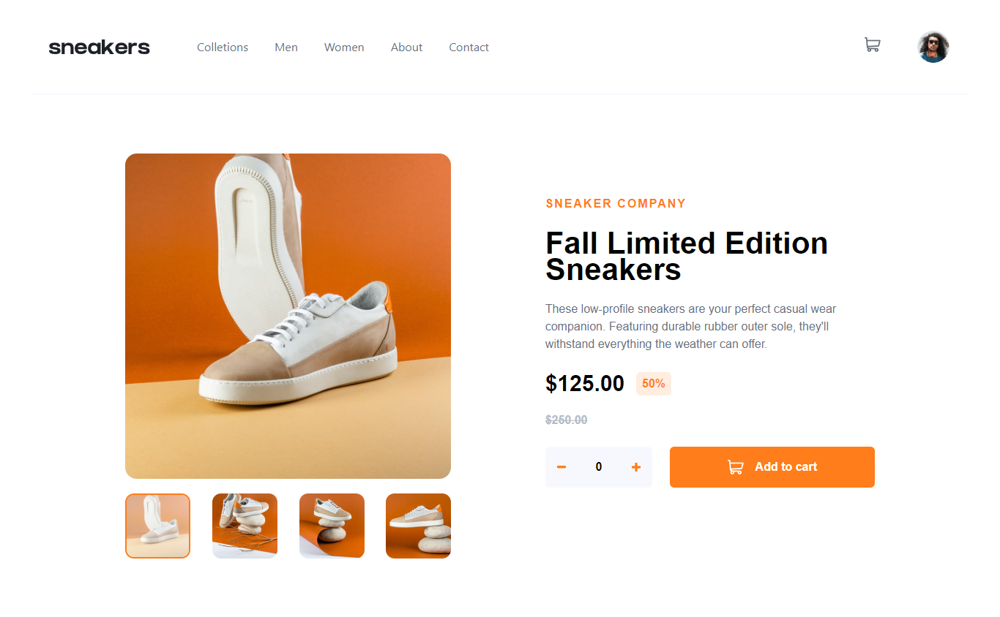
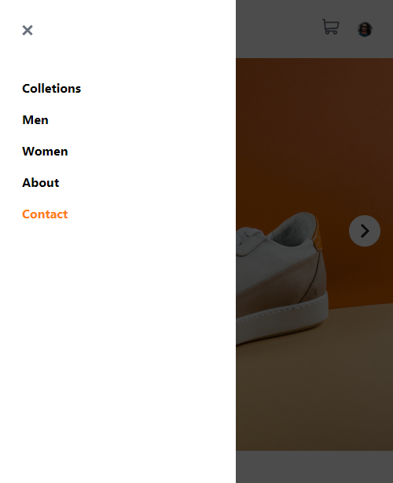

# Frontend Mentor - Space tourism website solution

This is a solution to the [E-commerce product page challenge on Frontend Mentor](https://www.frontendmentor.io/challenges/ecommerce-product-page-UPsZ9MJp6). Frontend Mentor challenges help you improve your coding skills by building realistic projects.

## Table of contents

- [Overview](#overview)
  - [The challenge](#the-challenge)
  - [Screenshot](#screenshot)
  - [Links](#links)
- [My process](#my-process)
  - [Built with](#built-with)
  - [Continued development](#continued-development)
- [Author](#author)

## Overview

### The challenge

Your challenge is to build out this e-commerce product page and get it looking as close to the design as possible.

You can use any tools you like to help you complete the challenge. So if you've got something you'd like to practice, feel free to give it a go.

Your users should be able to:

- View the optimal layout for the site depending on their device's screen size
- See hover states for all interactive elements on the page
- Open a lightbox gallery by clicking on the large product image
- Switch the large product image by clicking on the small thumbnail images
- Add items to the cart
- View the cart and remove items from it

### Screenshot

### Links

- Solution URL: [Add solution URL here](https://github.com/JamesBarr456/Ecommerce-Product-Page)
- Live Site URL: [Add live site URL here](https://ecommer-page.netlify.app/)

## My process

### Built with

- Semantic HTML5 markup
- CSS custom properties
- Flexbox
- Mobile-first workflow
- [Vite](https://vitejs.dev/)
- [Tailwind CSS](https://tailwindcss.com/) - CSS framework
- [React](https://reactjs.org/) - JS library

### Continued development

"This project was a challenge to further improve my practices in React + Tailwind. There are some things regarding the design of the challenge that I couldn't achieve, such as the Sidebar, and I will update it at some point to improve it even more. Another thing is that I tried to modularize as much as possible to make the code easy to understand, but I found myself at a point where I said 'Would it be better to simplify more or would doing it alone complicate the code even more?'. For my future projects, I will add TypeScript code to improve the security of the components."

## Author

- Github: [Barreto Santiago Emmanuel](https://github.com/JamesBarr456)
- Frotend Mentor: [@JamesBarr456](https://www.frontendmentor.io/profile/JamesBarr456)
- Instagram: [@barretoemmanuel](https://www.instagram.com/barretoemmanuel/)
